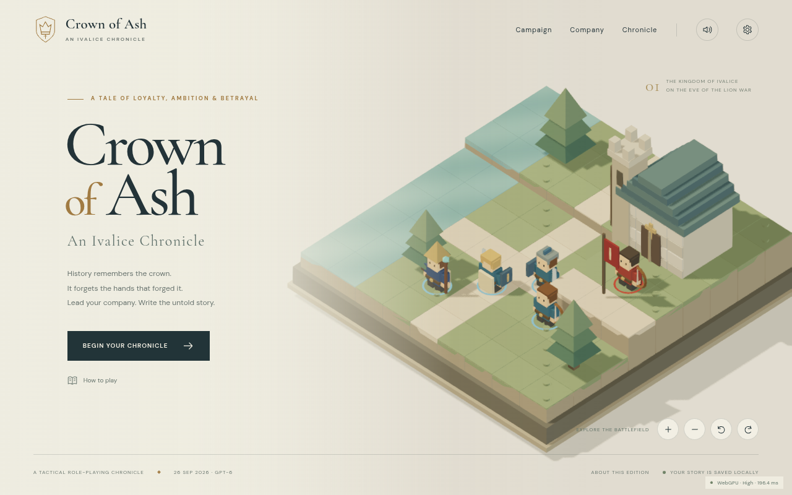

# Crown of Ash

**An Ivalice Chronicle** — a playable, browser-based tactical campaign based on the original English PlayStation **Final Fantasy Tactics** and the supplied `FFT_Unified_Guide.md`.

Generated **26 September 2026** with **GPT-6 (Codex)**. Internal, non-commercial test edition.



Lead Ramza's company through the Lion War and the Lucavi conspiracy. Fight on elevated isometric boards, manage CT initiative and spell charges, learn jobs with JP, choose secondary commands and passive slots, equip your company, recruit the secret characters, and explore Deep Dungeon. The campaign has a playable ending and a postgame return to optional content.

## Run locally

Use Node.js 22.12+ or Node.js 24 LTS.

```sh
npm ci
npm run dev
```

Open the local URL printed by Vite. A browser supporting WebGPU or WebGL2 is required. The renderer automatically chooses a backend; `?backend=webgl` forces the fallback for diagnostics. No API keys, database, accounts, or remote game server are required. Audio and fonts are served locally.

```sh
npm run build       # Production files in dist/
npm run preview     # Serve the production build
npm test            # Tactical simulation, progression, persistence tests
npm run extract     # Rebuild structured data/checklist from the supplied guide
node scripts/check-content.mjs
```

Browser verification uses the pinned Playwright test runner and installed Google Chrome:

```sh
npm run build
xvfb-run -a npm run test:e2e    # Linux/WSL, including actual WebGPU captures
```

To additionally inspect the ending from a save generated by the legal full-campaign simulation:

```sh
EXPORT_COMPLETED_SAVE=1 npm test
VERIFY_ENDING=1 xvfb-run -a npm run test:e2e
```

On a desktop with a working display, `npm run test:e2e` is sufficient. Set `CHROME_PATH` to a Chromium executable if Chrome is installed at a nonstandard location. Xvfb is a verification dependency only, never a deployment dependency. Browser tests save evidence under `artifacts/`.

## Play

- **Click / tap** a blue tile to move. Choose Attack, Abilities, or Items, then select a target. Attack and spell targets require confirmation, including on touch.
- **1–5** select Move, Attack, Abilities, Items, and Wait. **Arrow keys + Enter** select a tile without a mouse.
- **Q / E** rotate the battlefield. Use the camera **+ / −**, mouse wheel, or two-finger pinch to zoom. Finish a turn by choosing a facing.
- **Escape** closes the current panel. Options contains the full controls reference, volume, mute, fullscreen, difficulty, quality, and diagnostics.
- In camp, open **Company** to change jobs, learn skills, equip reaction/support/movement slots, select a secondary command set, fit equipment, and choose the deployed party.
- The **Soldier Office** hires new recruits with a chosen starting discipline and zodiac sign. Recruit monsters through Talk Skill, keep them in your company, and hatch their eggs in the **Incubator** as your journey continues.
- The outfitter sells unlocked equipment and finite supplies. **Errands & expeditions** includes dispatches, recruitment visits, optional battles, and wilderness patrols.
- **Story** is a forgiving first journey; **Tactical** rewards deliberate preparation. Both contain the complete campaign. Change difficulty between battles.

Progress saves in this browser's local storage. **Save now** suspends the current battle, including CT, cast queues, HP, and positions. A separate camp checkpoint is retained before each encounter. Clearing browser storage removes local progress. Saves are not cloud-synchronized.

## Deploy to Vercel

Import this GitHub repository into Vercel. The included `vercel.json` selects Vite, runs `npm run build`, and publishes `dist`. Leave the root directory at the repository root. No environment variables or manual build configuration are needed.

The repository is a private internal testing edition with original-game audio placeholders.

## Rendering and performance

Dependencies are pinned in `package.json` and `package-lock.json`: Vite 8.3.1, Three.js 0.186.1, Rapier compatibility build 0.21.0, and Playwright 1.63.0 for verification.

`WebGPURenderer` from `three/webgpu` draws the same scene on WebGPU and WebGL2. All custom shading uses TSL and node materials. The node `RenderPipeline` provides restrained bloom and FXAA. Materials use a generated floating-point HDR sky, directional shadows, and local contact shading. Static toy bricks are merged by material to reduce draw calls. No texture packs, sprites, `ShaderMaterial`, `EffectComposer`, or `onBeforeCompile` are used.

| Preset | Maximum pixel ratio | Shadow map | Post effects | Dynamic body cap | Maximum physics steps/frame |
| --- | ---: | ---: | --- | ---: | ---: |
| High | 1.65 | 2048² | Bloom + FXAA | 40 | 5 |
| Balanced | 1.0 | 1024² | FXAA | 16 | 3 |
| Auto | Measured selection | Follows selected tier | Follows selected tier | Follows selected tier | Follows selected tier |

Auto samples actual frame times after warmup and selects Balanced when the sustained average exceeds 24 ms. It does not use device names. Physics advances at a fixed 60 Hz, interpolates position and orientation for rendering, uses simple cuboid colliders, and removes expired bodies and old terrain colliders. The diagnostics display reports the active backend, effective preset, and measured frame time. Software-rendered test runs are correctness evidence, not hardware performance benchmarks.

## Audio manifest and placeholder credits

Every track and sound cue loads through [`public/audio/manifest.json`](public/audio/manifest.json). Replace the asset URLs and cue offsets there to substitute original audio without changing game code. Browser playback begins after the first interaction.

Original music and jingles are by **Hitoshi Sakimoto and Masaharu Iwata**, from **Final Fantasy Tactics** (Square, 1997). The files below were obtained from [Zophar's FFT PSF gamerip](https://www.zophar.net/music/playstation-psf/final-fantasy-tactics). Music was transcoded to 128 kbps MP3 for the test build.

| Local placeholder | Source asset | Use |
| --- | --- | --- |
| `public/audio/world.mp3` | [117 World Map](https://fi.zophar.net/soundfiles/playstation-psf/final-fantasy-tactics/117%20World%20Map.mp3) | Title, camp, ending |
| `public/audio/battle.mp3` | [109 Trisection](https://fi.zophar.net/soundfiles/playstation-psf/final-fantasy-tactics/109%20Trisection.mp3) | Battle music |
| `public/audio/victory.mp3` | [113 Mission Complete](https://fi.zophar.net/soundfiles/playstation-psf/final-fantasy-tactics/113%20Mission%20Complete.mp3) | Victory |
| `public/audio/reward.mp3` | [912 Treasure Discovery S](https://fi.zophar.net/soundfiles/playstation-psf/final-fantasy-tactics/912%20Treasure%20Discovery%20S.mp3) | Treasure, reward, confirmation; short healing cue |
| `public/audio/job.mp3` | [915 Job Change](https://fi.zophar.net/soundfiles/playstation-psf/final-fantasy-tactics/915%20Job%20Change.mp3) | Job/ability feedback; short selection, movement, hit and cast cues |

The shortened battle/UI cues are **adaptations of source jingles**, not claims to reproduce the original individual sword, footstep, or spell sound effects. The requested [Sounds Resource PlayStation F catalog](https://sounds.spriters-resource.com/playstation/F/) was checked on 26 September 2026; it did not list Final Fantasy Tactics. No unrelated game's sound effects were substituted. All included source audio therefore comes from the other requested source, Zophar.

## Source and implementation notes

Read [`COMPLETION_REPORT.md`](COMPLETION_REPORT.md), the full [source checklist](docs/SOURCE_CHECKLIST.md), and the [content audit](docs/CONTENT_AUDIT.md) for precise coverage and adaptations. The in-game Chronicle preserves the complete searchable source archive, loaded only when needed. Archiving a record is explicitly distinguished from implementing a mechanic.

Original guide authors and researchers: BoardFourSixNineFour/Overated and collaborators; AeroStar, Aaditya Rangan and Town Knave; Son_Kain/Kain Stryder; Tsogtsaihan Baatar; Vercingetorix; and Serin Tobias. Additional attributions and original usage notices remain in the supplied guide. Game characters, story, music, and intellectual property belong to Square/Square Enix. The code-built toy geometry and interface are new for this adaptation.

Locally served Cormorant Garamond and DM Sans fonts are distributed under the SIL Open Font License; license texts are in `public/fonts/`.
